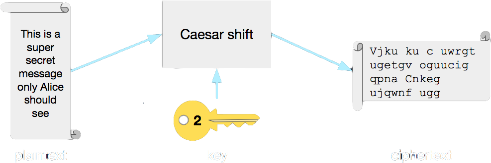

class: left, top
# Information Assurance
the formal and more complicated name for computer security

### .right[what even is it?]

---

### Keeping secrets secret

Information assurance is about making sure people can only see the information
they're supposed to see, and ensuring that the information is what it claims
to be.

* Confidentiality
* Integrity
* Authorization

---

### A quick aside...

Traditionally, the information security triad is .highlight[confidentiality],
.highlight[integrity], and .highlight[availability].  Authorization is really
part of confidentiality.

Availability isn't ***strictly*** concerned with the security of information
but it is a critical part of system operations.  For our purposes, availability
can generally be considered .highlight[someone else's problem].

Authorization is a complex topic and is more relevant outside of the operations
world.  This is not to downplay the importance of availability or operations.
.loud[The rest of this would be pointless if information resources weren't available!]

---

class: section, middle, center
# Confidentiality
making sure the neighbor reading your mail doesn't learn anything useful

---

### Confidentiality

1. Ensures that only the parties involved in a communication can see the
information in it
2. Ensures that outsiders cannot learn information based on the _shape_
of the data
3. Does ***not*** ensure that the information is what you think it is,
nor that you're talking to who you think you're talking to.

---

### Confidentiality

# .white[Physical space]
.loud[Confidentiality in meatspace]

---

### Confidentiality / .white[Physical space]

In the physical world, confidentiality is easy to understand (though sometimes
hard to implement):

* Face-to-face conversation
* Handing a note directly to the person you want to read it
* Having meetings in a sound-proof room
* That SCIF-life

---

### Confidentiality

# .white[Cryptography]
.loud[Confidentiality in the digital world]

---

### Confidentiality / .white[Crypto]

Cryptography is the study of secure information transmission. It includes
encryption, decryption, secure hashing, secure random number generation,
and more.

It assumes that other people already have access to your communications
channel and attempts to make it impossible for them to read your
information even though they can see it.

---

### Confidentiality / .white[Crypto]

Encryption is mixing up some information so people can't read it
without knowing how it was mixed up.

<table cellspacing="0" cellpadding="0">
  <tr class="first-row">
    <td>a</td>
    <td>b</td>
    <td>c</td>
    <td>d</td>
    <td>e</td>
    <td>f</td>
    <td>...</td>
  </tr>
  <tr class="second-row">
    <td class="empty"></td>
    <td class="empty"></td>
    <td>a</td>
    <td>b</td>
    <td>c</td>
    <td>d</td>
    <td>...</td>
  </tr>
</table>

.loud[c] becomes .highlight[a], .loud[d] becomes .highlight[b],
.loud[e] becomes .highlight[c], and so on...

---

### Confidentiality / .white[Crypto >] .highlight[Terms]

1. **Plaintext**
> The original information, before it is encrypted or after it is decrypted

2. **Ciphertext**
> The information in encrypted form, hopefully impossible to read

3. **Cipher**
> The algorithm that describes how to turn plaintext into ciphertext and vice-versa

---

### Confidentiality / .white[Crypto >] .highlight[It's hard!]

* Don't want to accidentally reveal anything
  * "shape" of the ciphertext (frequency of letters, number of words, length of
    information, etc.) can tell you about the plaintext
  * the cipher that was used makes it easier to attack the ciphertext
* Don't want to create weaknesses in the cipher
  * bad random number generation
  * mathematical oddities
  * "magic" numbers (i.e., back doors)

---
class: center, middle

.huge[SO DON'T EVER MAKE YOUR OWN]

---

### Confidentiality / .white[Crypto >] .highlight[It's hard!]

Always use well-known, well-established encryption ciphers, particularly those
vetted by NIST.  These ciphers have been carefully developed and researched
by dedicated cryptographers and mathematicians to root out as many hidden
mistakes as possible.

* Advanced Encryption Standard (AES)
* RSA
* Twofish

---

### Confidentiality / .white[Crypto >] .highlight[It's hard!]

Sometimes the well-known ciphers are later shown to have vulnerabilities. Here
are a few fairly common ciphers that are no longer considered safe and should
generally be avoided:

* Data Encryption Standard (DES)
* Triple DES
  * despite the name, it's only really about twice as strong as DES
* Rivest Cipher 4 (RC4)

On the internet, web servers that support these ciphers in SSL are considered
to be at risk.

---

class: section, middle, center
# Integrity
making sure your neighbor didn't change your letters

---

### Integrity

In information assurance, integrity is *just* about making sure the information
you receive is the same information that was sent.  That is, nobody in the
middle changed anything.

---

### Integrity

# .white[Physical space]
.loud[Integrity in meatspace]

---

### Integrity / .white[Physical space]

In the physical world, integrity can be tricky:

* Check that the handwriting matches the sender's
  * like on those credit card signature slips that nobody ever looks at
* Check that your mail wasn't opened
  * like back in the old days when letters were sealed with wax seals
* Send them a text and ask if they really wrote that letter
* Send them an email asking if they got your text
  * don't do that

---

### Integrity
# .white[Cryptography]
.loud[Integrity in the digital world]

---

### Integrity / .white[Crypto]

Yep, cryptography again.  But this time, we don't rely on encryption. Instead,
we rely on one-way algorithms that transform some data into some other data
in such a way that it cannot be transformed back.

...That really sounds useless, doesn't it?

---

### Integrity / .white[Crypto]

These algorithms are called cryptographic hash functions. When you get some data
in, the result is called a hash (sometimes they're called digests or fingerprints).

`hash("Hello world") => 3e25960a79dbc69b674cd4ec67a72c62`

.highlight[(real example!)]

---

### Integrity / .white[Crypto >] .highlight[Hash properties]

1. **One-way**
> Once data is used to compute a hash, it should be impossible to get back to
the original data from the hash

2. **Unique**
> Very, very unlikely that two different data will result in the same hash

3. **Easy to make**
> Making a hash is mathematically easy to do (but not necessarily *fast*)

---

### Integrity / .white[Crypto >] .highlight[Use of a hash]

* Alice writes a letter to Bob and then computes the hash for the letter
* Alice puts the letter in the mail, and texts the hash to Bob
* When Bob gets the letter, he also computes the hash
* If Bob's hash matches the one he got from Alice, it's the same letter!
Otherwise, it has been tampered with.

This is called "fingerprinting" - using a hash to ensure the information you
received is the same information that was sent

---

class: section, middle, center
# Authorization
preventing your neighbor from reading your mail in the first place

---

### Authorization

Authorization is about making sure people can only see and do the things
they're supposed to be able to see and do.  This requires being able to
identify people, which is called .highlight[authentication].

---

### Authorization

# .white[Physical space]
.loud[Authorization in meatspace]

---

### Authorization / .white[Physical space]

1. **Walls**
> Limits the options of people trying to enter a building to just openings
like doors and windows

2. **Guards**
> Security guards prevent people from entering a place unless they're authorized

3. **Lock & key**
> Locks keep people from accessing things unless they have the key

---

### Authorization

# .white[Access Controls]
.loud[Authorization in the digital world]

---

### Authorization / .white[Access control >] .highlight[Walls]

Like in physical space, we can have "digital walls" that prevent access to digital
resources.  Mostly these are .highlight[firewalls], devices that sit on the network
and deny access to internal assets from outside.

---

### Authorization / .white[Access control >] .highlight[Guards]

We also have "guards" that only allow authoried access

* Password required to log into your computer
* Permission required to access someone else's files on Google Drive
* Thumbprint required to access your phone

These guards are all software that has to be carefully checked to verify that it
is checking the user's credentials and only allowing the access they're supposed
to have.

---

### Authorization / .white[Access control >] .highlight[Guards]

Guards can check for a lot of things

* Do you have access to this website?
* Do you have permission to edit blog posts?
* Do you have permission to merge a pull request?

These are called .highlight[permissions].

---

### Authorization / .white[Access control >] .highlight[Keys]

# .white[Cryptography]
.loud[Yep, this again]

---

### Authorization / .white[Access control >] .highlight[Keys]

Encryption has four parts: .highlight[plaintext], .highlight[cipher], .highlight[key],
and .highlight[ciphertext].

.center[]

---

### Authorization / .white[Access control >] .highlight[Keys]

Remember this?

<table cellspacing="0" cellpadding="0">
  <tr class="first-row">
    <td>a</td>
    <td>b</td>
    <td>c</td>
    <td>d</td>
    <td>e</td>
    <td>f</td>
    <td>...</td>
  </tr>
  <tr class="second-row">
    <td class="empty"></td>
    <td class="empty"></td>
    <td>a</td>
    <td>b</td>
    <td>c</td>
    <td>d</td>
    <td>...</td>
  </tr>
</table>

This is simple encryption! It represents a cipher called .highlight[Caesar Shift]
(or sometimes .highlight[Caesar cipher]) with a key of .highlight[2]. The key is
the secret that tells you how the cipher was applied. In this case, it shifts the
letters by 2.

---

### Authorization / .white[Access control >] .highlight[Keys]

How about an example?

.center[]

---

### Authorization / .white[Access control >] .highlight[Keys]

How does this provide authorization? Only someone who knows the cipher and the
.highlight[key] can decrypt the ciphertext.  If you only share the key with the
people you want to read the message, then only they'll be able to read it.  The
key is, well, a key!

.loud[Life pro tip]: don't treat the cipher like a secret. It's usually pretty
easy to tell what family of cipher was used
